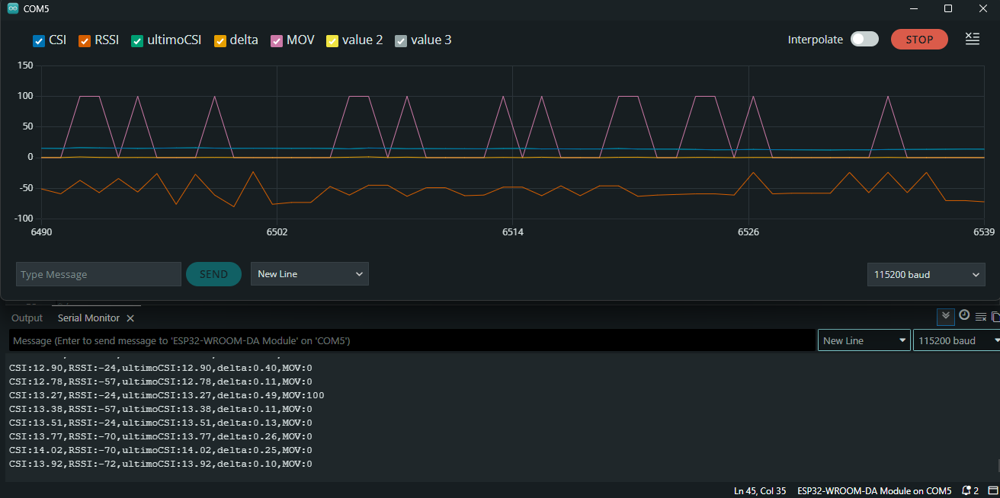
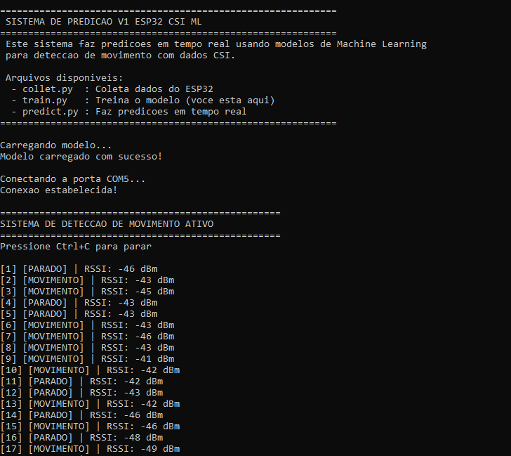

# CSI ESP32 - Deteccao de Movimento com Wi-Fi

## 🎯 Sobre o Projeto

Este projeto explora o uso do **ESP32** para capturar dados CSI do Wi-Fi e aplicar tecnicas de **Machine Learning** para detectar movimentos no ambiente. O sistema funciona sem necessidade de cameras ou sensores de presenca tradicionais, utilizando apenas as variacoes no sinal Wi-Fi.

## 📡 O que e CSI (Channel State Information)?

CSI (Channel State Information) e uma tecnologia que permite capturar informacoes detalhadas sobre o estado do canal de comunicacao Wi-Fi. Diferente do RSSI (Received Signal Strength Indicator), que fornece apenas a intensidade do sinal, o CSI captura:

- **Amplitude e fase** de cada subportadora do sinal Wi-Fi
- **Informacoes sobre multiplos caminhos** (multipath) do sinal
- **Variacoes sutis** causadas por movimentos no ambiente

Essas caracteristicas tornam o CSI ideal para aplicacoes de **deteccao de movimento sem contato**, **reconhecimento de gestos**, **monitoramento de atividades** e **sistemas de seguranca**.

### Aplicacoes Praticas

- 🏠 **Smart Home**: Deteccao de presenca e automacao residencial
- 🔒 **Seguranca**: Sistemas de alarme e monitoramento de intrusos
- 👴 **Saude**: Monitoramento de quedas e atividades de idosos
- 🎮 **Interfaces**: Controle por gestos sem contato
- 💡 **IoT**: Dispositivos inteligentes sensíveis ao contexto

## 📂 Estrutura do Projeto

O projeto esta organizado em duas versoes principais:

### 📁 [v0_csi_realtime_monitor/](v0_csi_realtime_monitor/)

**Versao Base - Monitor em Tempo Real**

- 🔹 Codigo Arduino basico para ESP32
- 🔹 Captura e transmissao de dados CSI via serial
- 🔹 Ideal para estudo inicial e entendimento do CSI
- 🔹 Visualizacao em tempo real dos dados brutos

**Quando usar:**
- Para aprender como o CSI funciona
- Para debug e analise de dados
- Como base para experimentos personalizados

**📖 [Documentacao completa da V1](v0_csi_realtime_monitor/README.md)**

### 📁 [v1_esp32_csi_ml/](v1_esp32_csi_ml/)

**Versao 1 - Machine Learning**

- 🔹 Sistema completo com pipeline de ML
- 🔹 Extracao automatica de features
- 🔹 Algoritmo Random Forest para classificacao
- 🔹 Deteccao de movimento em tempo real
- 🔹 Scripts Python para coleta, treinamento e predicao

**Quando usar:**
- Para aplicacoes praticas de deteccao de movimento
- Para sistemas de producao
- Para expandir com novos classificadores

**📖 [Documentacao completa da V1](v1_esp32_csi_ml/README.md)**

---
## 👤 Autor

**Gabriel Portugal**  
💼 [Portfólio](https://gabrielportugal.web.app/)  
💻 [LinkedIn](https://www.linkedin.com/in/gabriel-portugal-b26a13188/)

## 📝 Licença
Projeto livre para estudos, pesquisas e experimentação com WiFi CSI e ESP32.