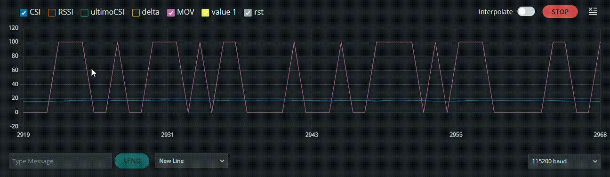

# CSI Realtime Monitor
Projeto utilizando o ESP32 para capturar informações de CSI (Channel State Information) do WiFi e visualizar alterações do ambiente em tempo real através do Arduino Serial Plotter.

O sistema detecta pequenas mudanças no sinal WiFi causadas por:
- movimento de pessoas
- presença no ambiente
- alterações físicas próximas ao roteador
- mudanças de propagação do sinal

**Observação:** caso esteja vendo pelo VS Code, utilizar o atalho `Ctrl+Shift+V` para melhor visualização.


## 📋 Índice
- [Funcionamento](#funcionamento)
- [Hardware Necessário](#hardware-necessário)
- [Instalação e Configuração](#instalação-e-configuração)
- [Como Usar](#como-usar)
- [Parâmetros Monitorados](#parâmetros-monitorados)
- [Configurações CSI](#configurações-csi)
- [Aplicações](#aplicações)
- [Possíveis Melhorias](#possíveis-melhorias)

## 🔧 Funcionamento
O ESP32 conecta em uma rede WiFi e ativa o modo CSI do chip WiFi da Espressif. A cada pacote WiFi recebido:
1. **Captura CSI**: Obtém dados brutos das subportadoras WiFi
2. **Calcula energia**: Soma absoluta dos valores das subportadoras dividido pelo tamanho do buffer
3. **Suavização exponencial**: Aplica filtro EMA (α=0.1) para reduzir ruído
4. **Detecção de movimento**: Calcula delta entre leituras consecutivas (threshold: 0.4)
5. **Visualização**: Envia CSI, RSSI, delta e detecção de movimento para Serial Plotter



## 🛠️ Hardware Necessário
- **Placa**: ESP32-WROOM-32
- **IDE**: Arduino IDE 1.8.x ou superior
- **Rede**: WiFi 2.4GHz (modo promíscuo ativado)
- **Cabo**: USB para programação e comunicação serial

## 📚 Bibliotecas Utilizadas
- `WiFi.h` - Conexão WiFi padrão
- `esp_wifi.h` - Acesso às funcionalidades CSI da Espressif

## ⚙️ Instalação e Configuração

### 1. Preparar Arduino IDE
- Instalar suporte para ESP32 via Board Manager
- Selecionar placa: **ESP32 Dev Module**
- Configurar porta serial correta

### 2. Configurar Credenciais WiFi
Edite as seguintes linhas no arquivo `plotter.ino`:

```cpp
const char* ssid = "SUA_REDE_WIFI";      // Nome da sua rede WiFi
const char* password = "SUA_SENHA";       // Senha da sua rede
```

### 3. Upload do Código
- Conecte o ESP32 via USB
- Clique em Upload na Arduino IDE
- Aguarde a gravação completa

## 🚀 Como Usar

### Abrindo o Serial Plotter
1. Após o upload, vá em: **Tools → Serial Plotter**
2. Configure Baud Rate para: **115200**
3. Você verá os gráficos em tempo real

### Testando a Detecção
- Mova a mão próximo ao ESP32
- Caminhe próximo ao roteador WiFi
- Observe os picos no gráfico quando houver movimento

## 📊 Parâmetros Monitorados

| Parâmetro | Descrição | Valores Típicos |
|-----------|-----------|-----------------|
| **CSI** | Energia média suavizada das subportadoras | Varia conforme ambiente |
| **RSSI** | Indicador de força do sinal (dBm) | -30 a -90 dBm |
| **ultimoCSI** | Último valor CSI registrado | Espelha CSI |
| **delta** | Diferença absoluta entre leituras | 0 = sem mudança |
| **MOV** | Detecção de movimento | 0 = sem movimento<br>100 = movimento detectado |

### Threshold de Movimento
O código detecta movimento quando `delta > 0.4`. Este valor pode ser ajustado na linha:

```cpp
if (delta > 0.4)  // Ajuste este valor conforme necessário
```

## 🔬 Configurações CSI

O projeto utiliza as seguintes configurações CSI:

```cpp
wifi_csi_config_t csi_config = {
    .lltf_en = true,           // Legacy Long Training Field
    .htltf_en = true,          // HT Long Training Field  
    .stbc_htltf2_en = true,    // STBC HT-LTF2
    .ltf_merge_en = true,      // Merge LTF data
    .channel_filter_en = true, // Filtro de canal
    .manu_scale = false,       // Escala manual desativada
    .shift = false             // Shift desativado
};
```

## 💡 Aplicações

- **Detecção de presença** - Sistemas de segurança sem câmera
- **Monitoramento indoor** - Análise de ocupação de ambientes
- **Sensing sem câmera** - Privacidade preservada
- **Análise de propagação WiFi** - Estudos de RF
- **Pesquisa em CSI** - Trabalhos acadêmicos
- **Computação ubíqua** - IoT e ambientes inteligentes
- **Sistemas de percepção ambiental** - Smart homes

## 🚀 Possíveis Melhorias

### Processamento de Sinal
- **FFT do CSI** - Análise de frequência para padrões complexos
- **Filtros avançados** - Kalman, Butterworth, adaptativo
- **Múltiplas antenas** - Usar diversidade espacial

### Inteligência Artificial
- **Classificação por IA** - Machine Learning para reconhecer padrões
- **Detecção de gestos** - Reconhecer movimentos específicos
- **Detecção respiratória** - Monitoramento de saúde

### Armazenamento e Visualização
- **Dashboard web** - Interface em tempo real via WebSocket
- **Armazenamento dos dados** - Logging em SD card ou nuvem
- **Gráficos 3D** - Visualização espacial do CSI

### Otimizações
- **Ajuste dinâmico de threshold** - Adaptação ao ambiente
- **Modo sleep** - Economia de energia entre medições
- **MQTT** - Integração com sistemas IoT

## ⚠️ Avisos Importantes

- **Modo Promíscuo**: O código ativa modo promíscuo WiFi, que pode não ser legal em todos os países. Verifique a legislação local.
- **Segurança**: As credenciais WiFi estão hardcoded. Para produção, use métodos mais seguros.
- **Performance**: O CSI gera muitos dados. Valores de delay podem precisar ajuste conforme o ambiente.

## 🐛 Troubleshooting

**Problema**: Serial Plotter não exibe gráficos
- Verifique se o Baud Rate está em 115200
- Confirme que o ESP32 está conectado
- Reinicie o ESP32 após abrir o Serial Plotter

**Problema**: Não detecta movimento
- Ajuste o threshold (valor 0.4) para maior ou menor sensibilidade
- Verifique se está próximo ao roteador WiFi
- Certifique-se de que está na rede WiFi 2.4GHz

**Problema**: Gráfico muito ruidoso
- Aumente o fator de suavização (de 0.9 para 0.95)
- Aumente o delay no loop de 50ms para 100ms

## 👤 Autor

**Gabriel Portugal**  
💼 [Portfólio](https://gabrielportugal.web.app/)  
💻 [LinkedIn](https://www.linkedin.com/in/gabriel-portugal-b26a13188/)

## 📝 Licença
Projeto livre para estudos, pesquisas e experimentação com WiFi CSI e ESP32.

---

**Última atualização**: Maio 2026