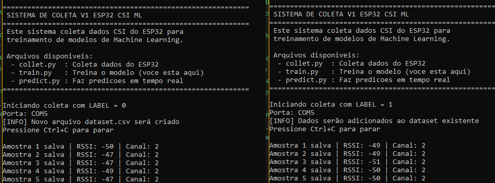
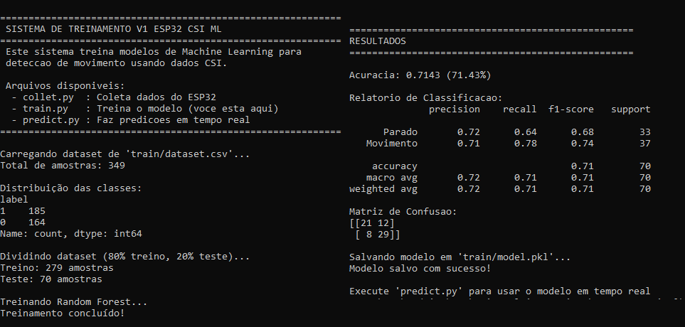

# V1 - Esp32 CSI ML - Random Forest
**Observação:** caso esteja vendo pelo VS Code, utilizar o atalho `Ctrl+Shift+V` para melhor visualização.

Este projeto utiliza um ESP32 para capturar dados de CSI (Channel State Information) do Wi-Fi e um pipeline em Python para realizar a classificação de movimento utilizando Machine Learning.

### 🔧 Hardware e Software
- ESP32-WROOM-32
- Rede Wi-Fi 2.4 GHz
- Arduino IDE
- Python 3.10 ou superior

### 📚 Instale todas as bibliotecas necessárias:
- pip install pyserial
- pip install numpy
- pip install pandas
- pip install scikit-learn
- pip install joblib

Ou utilizando um único comando:

`pip install pyserial numpy pandas scikit-learn joblib`
## ✅ Verificar Setup (Recomendado)

Antes de começar, teste se tudo está funcionando corretamente:

```bash
cd ...\v1_esp32_csi_ml\python
python test_connection.py
```

Este script irá:
- ✅ Verificar se todas as dependências estão instaladas
- ✅ Listar portas seriais disponíveis
- ✅ Testar conexão com o ESP32
- ✅ Validar que dados CSI estão sendo recebidos

**Importante**: Execute este teste após fazer o upload do código para o ESP32.
## 📡 Upload do Código para o ESP32

Para carregar o código no ESP32, siga os passos abaixo:

### 1. Abrir o Arduino IDE
- Abra o Arduino IDE no seu computador
- Navegue até o arquivo `v1_esp32_csi_ml.ino`

### 2. Configurar a Placa
- Vá em **Ferramentas** → **Placa** → **ESP32 Arduino**
- Selecione **ESP32 Dev Module** ou **ESP32-WROOM-DA Module**

### 3. Configurar a Porta Serial
- Conecte o ESP32 ao computador via cabo USB
- Vá em **Ferramentas** → **Porta**
- Selecione a porta COM correspondente (ex: COM5, COM3, etc.)

### 4. Fazer o Upload
- Clique no botão **Upload** (seta para direita) ou pressione `Ctrl+U`
- Aguarde a compilação e o upload do código
- Após concluído, o ESP32 estará pronto para enviar dados CSI

### 5. Verificar o Funcionamento
- Abra o **Monitor Serial**: **Ferramentas** → **Monitor Serial**
- Configure a velocidade para **115200 baud**
- Você deverá ver os dados CSI sendo enviados no formato: `RAW,timestamp,rssi,channel,csi_values...`

## 🐍 Como Executar os Scripts Python

Os scripts Python devem ser executados na pasta `python/` do projeto.

### 1. Navegue até a pasta do projeto
```bash
cd ...\v1_esp32_csi_ml\python
```

### 2. Verifique a Porta Serial
Antes de executar qualquer script, certifique-se de que a variável `PORT` nos arquivos Python está configurada corretamente:

```python
PORT = "COM5"  # Ajuste para a porta do seu ESP32
```

Para listar todas as portas COM disponíveis:
```bash
python check_ports.py
```

### 📋 Scripts Disponíveis

#### 1. **collet.py** - Coleta de Dados
Coleta dados CSI e salva no arquivo `train/dataset.csv`:
```bash
python collet.py
```
- Configure a variável `LABEL` (0 para parado, 1 para movimento)
- Mantenha o ESP32 conectado e o script rodando durante a coleta



#### 2. **train.py** - Treinamento do Modelo
Treina o modelo Random Forest com os dados coletados:
```bash
python train.py
```
- Certifique-se de ter dados suficientes no arquivo `train/dataset.csv`
- O modelo será salvo em `train/model.pkl`




#### 3. **predict.py** - Predição em Tempo Real
Realiza predições em tempo real:
```bash
python predict.py
```
- Requer o modelo treinado (`train/model.pkl`)
- Exibe classificações em tempo real (PARADO ou MOVIMENTO)


## 🔄 Fluxo do Projeto

### Fluxo Técnico:
```
┌─────────────┐      ┌──────────────┐      ┌─────────────────┐
│   ESP32     │ USB  │  collet.py   │      │   dataset.csv   │
│ Captura CSI │─────>│ Coleta dados │─────>│ Dados rotulados │
└─────────────┘      └──────────────┘      └─────────────────┘
                                                      │
                                                      v
┌─────────────┐      ┌──────────────┐      ┌─────────────────┐
│  predict.py │<─────│  model.pkl   │<─────│    train.py     │
│ Tempo real  │      │ Random Forest│      │ Treina modelo   │
└─────────────┘      └──────────────┘      └─────────────────┘
```

### Fluxo de Uso:
1. ⚙️ Upload do código para ESP32
2. 📊 Executar `collet.py` para coletar dados (LABEL=0 e LABEL=1)
3. 🎯 Executar `train.py` para treinar o modelo
4. ⚡ Executar `predict.py` para predições em tempo real

## 🎓 Preparo para o Treinamento
Antes de treinar o modelo, é necessário criar um conjunto de dados contendo exemplos de cada classe.

### 🧍 Classe 0 — Parado
- Configure: LABEL = 0
- Execute: python collet.py
- Permaneça parado durante aproximadamente 30 a 60 segundos.
- Os dados serão gravados em: train/dataset.csv

### 🏃 Classe 1 — Movimento
- Altere: LABEL = 1
- Execute novamente: python collet.py
- Caminhe ou movimente-se no ambiente durante aproximadamente 30 a 60 segundos.
- Os dados serão adicionados ao mesmo arquivo: train/dataset.csv

### 📋 Estrutura do Dataset
Cada linha do dataset contém:
- timestamp:	Tempo da captura
- rssi: Intensidade do sinal Wi-Fi
- channel: Canal Wi-Fi
- mean: Média do CSI
- var: Variância
- std: Desvio padrão
- energy: Energia total
- max: Valor máximo
- min: Valor mínimo
- label: Classe

Exemplo: 15432,-48,1,16.2,3.1,1.7,2200,32,-18,0

## 🎯 Treinamento do Modelo
Após coletar dados suficientes das duas classes, execute: `python train.py`

O treinamento utiliza o algoritmo Random Forest.

Durante o treinamento será exibida a acurácia obtida: `Accuracy: 0.91`

Ao final será criado o arquivo: `train/model.pkl`

Este arquivo contém o modelo treinado.

## ⚡ Execução em Tempo Real

Após o treinamento, execute: `python predict.py`

O sistema começará a ler continuamente os dados enviados pelo ESP32.

📤 Saídas Possíveis
- Ambiente Parado
- PARADO
- Movimento Detectado
- MOVIMENTO

## 🔬 Features Utilizadas

Na V1 são utilizadas as seguintes características extraídas do CSI:

### Média
Representa a intensidade média das subportadoras.

### Variância

Mede o quanto o sinal varia.

### Desvio Padrão

Indica a dispersão dos valores do CSI.

### Energia

Soma da magnitude das subportadoras.

### Máximo

Maior valor observado no vetor CSI.

### Mínimo

Menor valor observado no vetor CSI.

### RSSI

Indicador de força do sinal Wi-Fi.

## 🤖 Algoritmo Utilizado
### 🌳 Random Forest

O Random Forest foi escolhido para a V1 devido a:

- Fácil implementação
- Baixo custo computacional
- Boa robustez contra ruído
- Excelente desempenho para classificação binária
- Boa interpretabilidade

## ⚠️ Limitações da V1

Esta primeira versão foi projetada para um cenário simples.

✅ Capacidades atuais:

- Detecção de presença
- Detecção de movimento
- Classificação parado/movimento

❌ Limitações:

- Não estima posição espacial
- Não detecta respiração
- Não diferencia múltiplas pessoas
- Não realiza rastreamento corporal

## 👤 Autor

**Gabriel Portugal**  
💼 [Portfólio](https://gabrielportugal.web.app/)  
💻 [LinkedIn](https://www.linkedin.com/in/gabriel-portugal-b26a13188/)

## 📝 Licença
Projeto livre para estudos, pesquisas e experimentação com WiFi CSI e ESP32.

---

**Última atualização**: Maio 2026